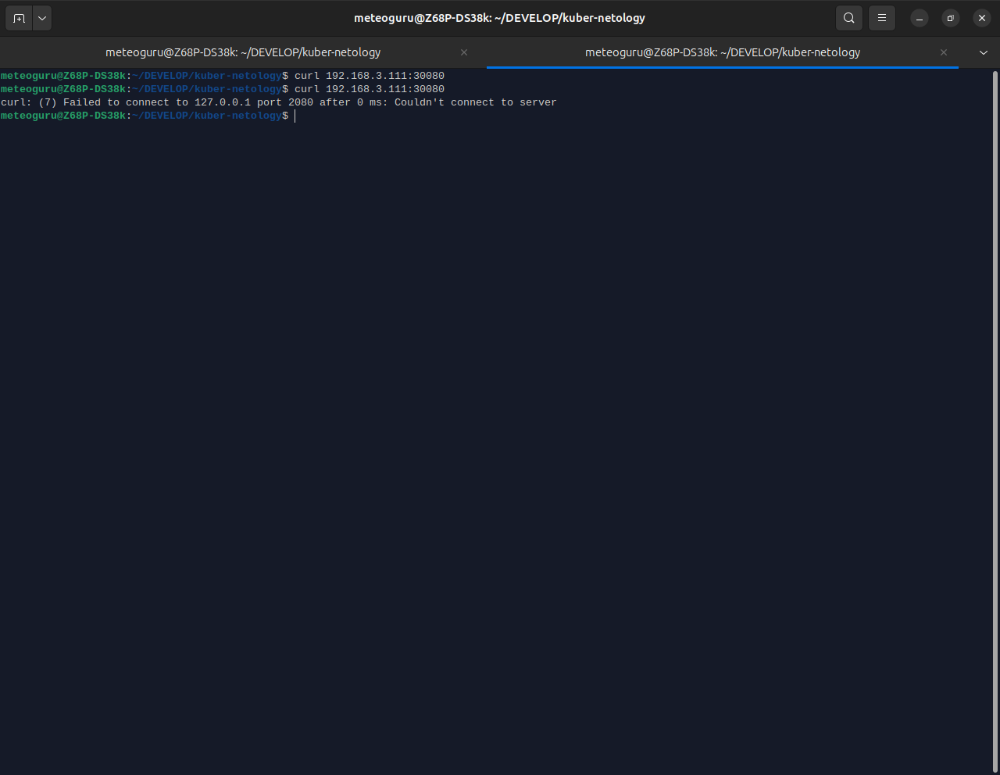
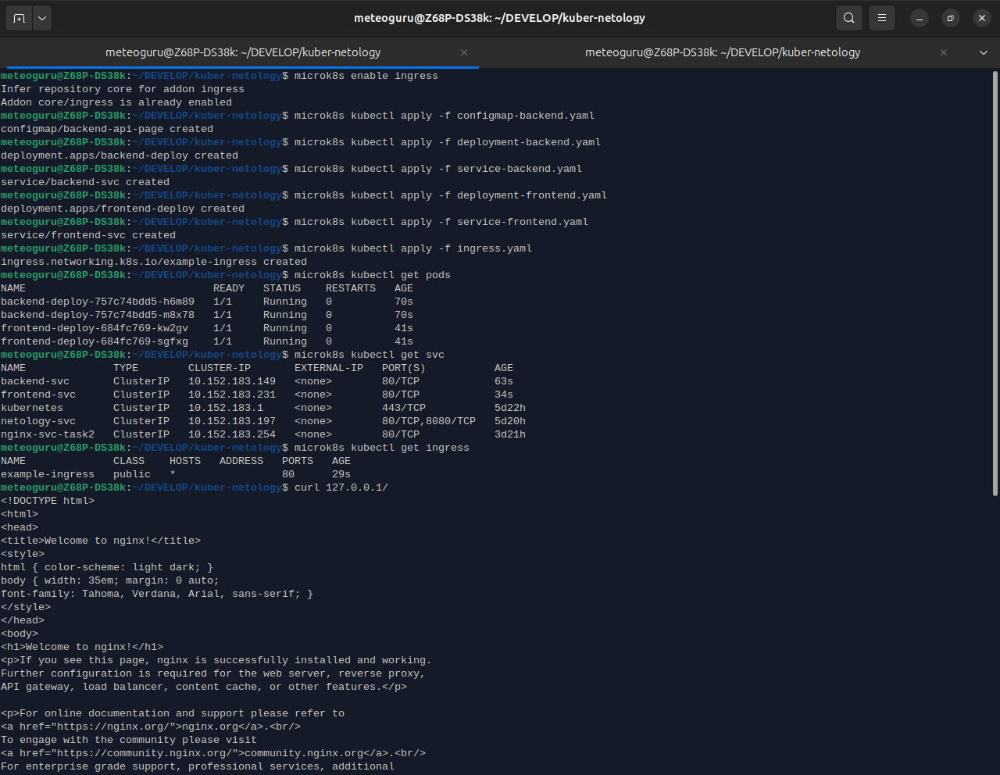
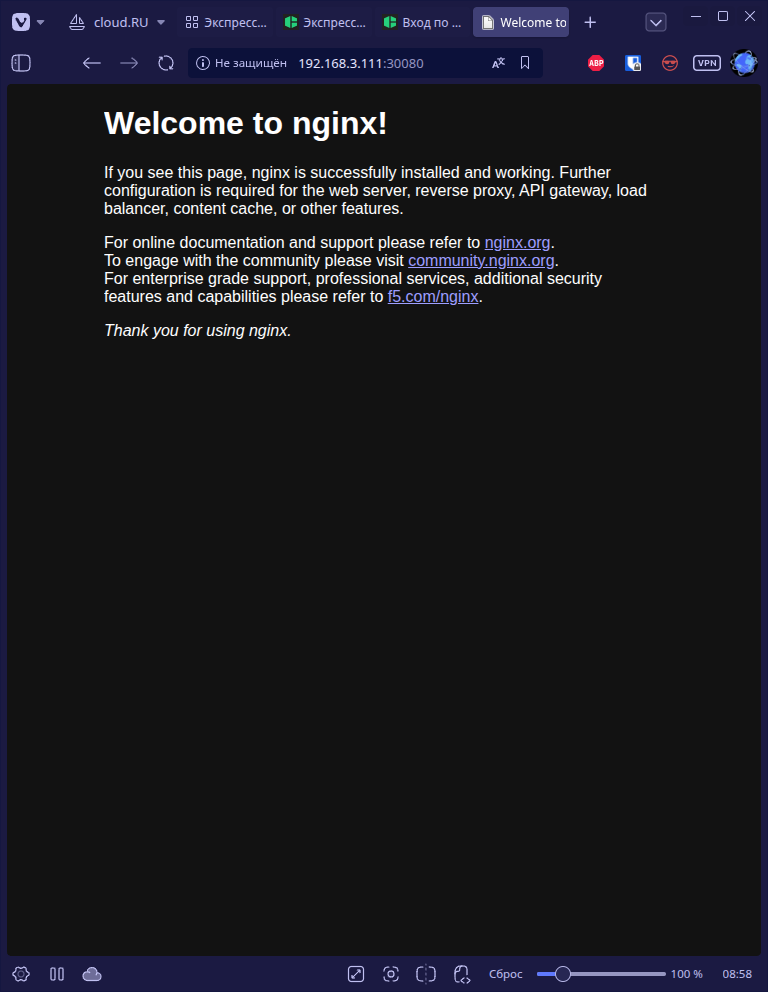

# Задание 1: Настройка Service (ClusterIP и NodePort)

1. Создать Deployment и обеспечить доступ к контейнерам приложения по разным портам из другого Pod внутри кластера

    * (я использовал microk8s, можно выполнить все команды про порядку)

### Запуск [Deployment](deployment-task3.yaml)

```
microk8s kubectl apply -f deployment-task3.yaml
```

### Запуск [Service](service-task3.yaml)

```
microk8s kubectl apply -f service-task3.yaml
```

### Запуск [Pod](multitool-pod.yaml)

```
microk8s kubectl apply -f multitool-pod.yaml
```

### Запуск [NodePort‑манифест](multitool-pod.yaml)

```
microk8s kubectl apply -f service-nodeport.yaml
```

### Проверки

```
# 3 Pod с двумя контейнерами + Pod multitool‑client

microk8s kubectl get pods
```

```
# сервис с портами 9001 и 9002.

microk8s kubectl get svc
```

```
# страница nginx на 9001 порту ⤵

microk8s kubectl exec -it multitool-client -- curl nginx-svc-task3:9001

# страница multitool на 9002 порту ⤵

microk8s kubectl exec -it multitool-client -- curl nginx-svc-task3:9002
```

```
# узнать IP ноды
microk8s kubectl get nodes -o wide

# пример: Internal-IP = 192.168.3.111
# проверить доступ к nginx через NodePort 30080

curl 192.168.3.111:30080

```


### Удаление ресурсов

```
microk8s kubectl delete -f deployment-task3.yaml

microk8s kubectl delete -f service-task3.yaml

microk8s kubectl delete -f service-nodeport.yaml

microk8s kubectl delete -f multitool-pod.yaml
```

#### screenshot №1

)

#### screenshot №2



#### screenshot №3
