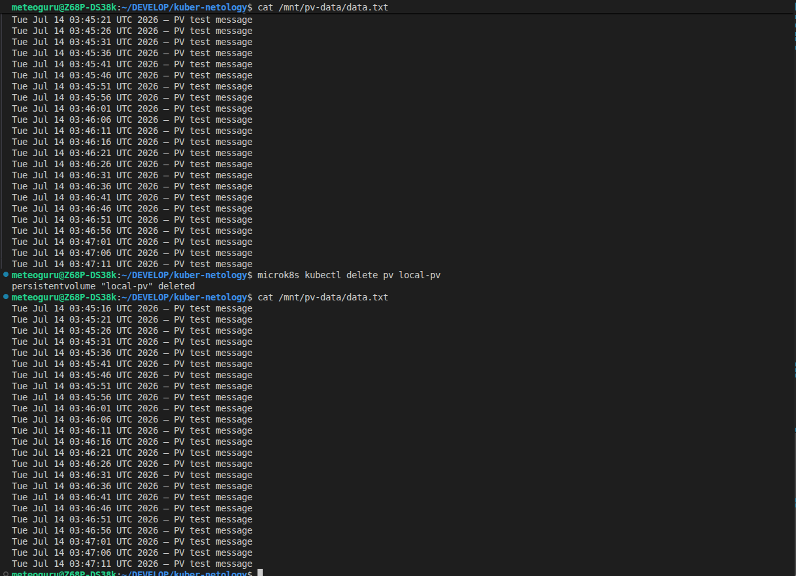
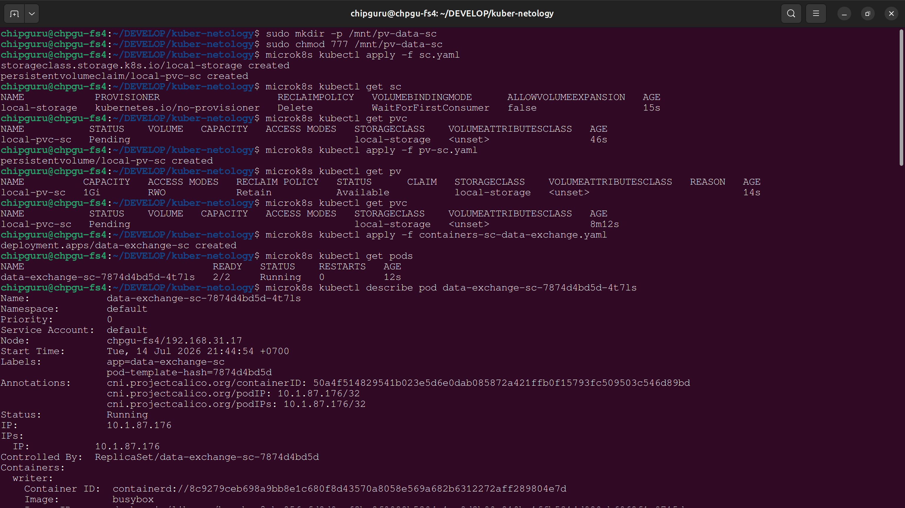
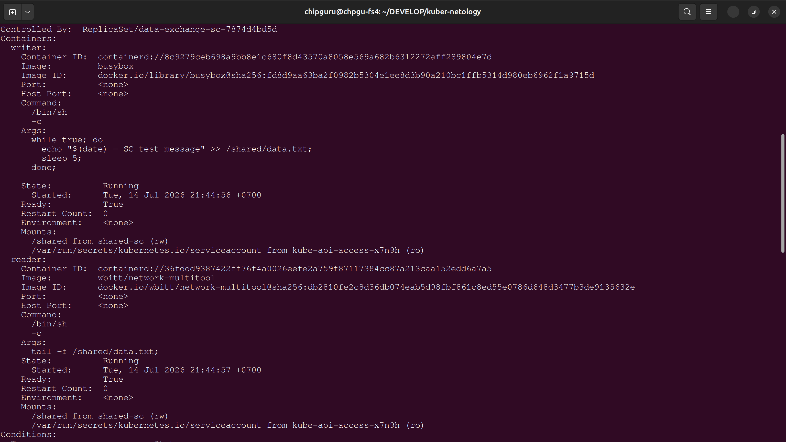
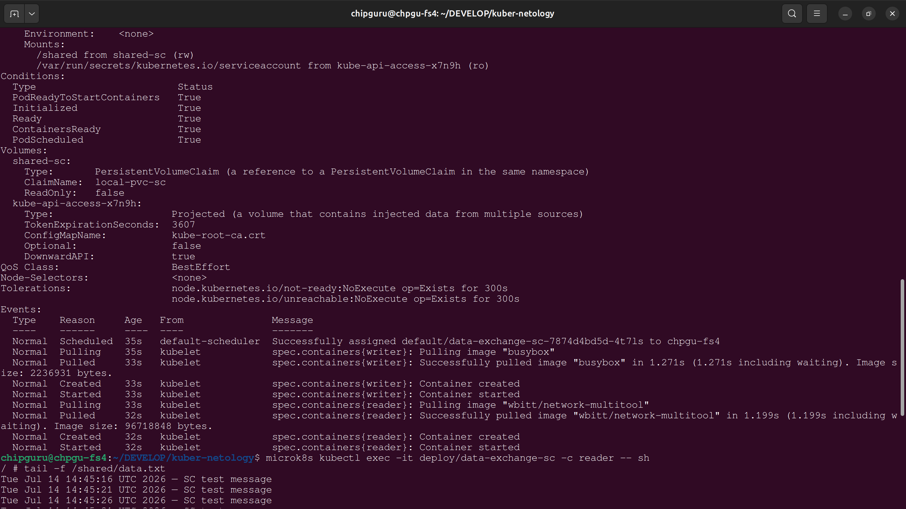
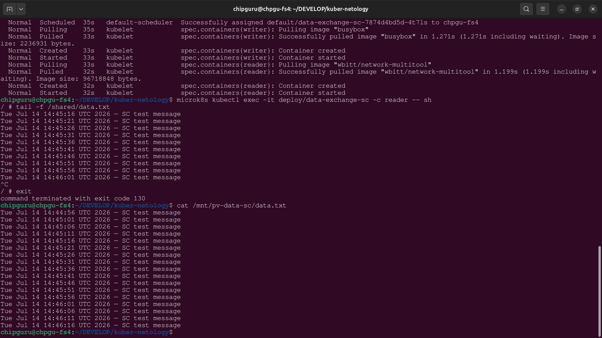

# Задание 1. Volume: обмен данными между контейнерами в поде

1. Создать Deployment приложения, состоящего из двух контейнеров, обменивающихся данными.

   * (я использовал microk8s, можно выполнить все команды про порядку)

### Прменение [манифеста](containers-data-exchange.yaml)

```
microk8s kubectl apply -f containers-data-exchange.yaml
```

### Проверка №1 — описание пода

```
# Получение имя pod

microk8s kubectl get pods
```

```
# Посмотреть описание:

microk8s kubectl describe pod data-exchange-<id>
```

### Проверка №2 — чтение файла из multitool

```
# Подключиться в контейнер reader:

microk8s kubectl exec -it deploy/data-exchange -c reader -- sh

# Внутри контейнера выполнить:

tail -f /shared/data.txt
```

### Удаление ресурсов

```
# удалить Deployment

microk8s kubectl delete -f containers-data-exchange.yaml
microk8s kubectl delete pod -l app=data-exchange --force --grace-period=0
microk8s kubectl get pods
```

### Screenshots


скриншот продложение ....


# Задание 2. PV, PVC

1. Создать Deployment приложения, использующего локальный PV, созданный вручную.

Манифесты:

* [pv-pvc.yaml](pv-pvc.yaml) — описание PV и PVC.
* [containers-pv-data-exchange.yaml](containers-pv-data-exchange.yaml) — Deployment с двумя контейнерами, использующими PVC.

Подготовка директории на ноде:

```
sudo mkdir -p /mnt/pv-data
sudo chmod 777 /mnt/pv-data
```

Создать [PV и PVC](pv-pvc.yaml)

```
microk8s kubectl apply -f pv-pvc.yaml

microk8s kubectl get pv

microk8s kubectl get pvc
```

Создать [Deployment](containers-pv-data-exchange.yaml):

```
microk8s kubectl apply -f containers-pv-data-exchange.yaml

microk8s kubectl get pods

microk8s kubectl describe pod pv-data-exchange-<id>
```

Проверить работу контейнеров:

```
microk8s kubectl exec -it deploy/pv-data-exchange -c reader -- sh

tail -f /shared/data.txt
```

Удалить Deployment и PVC:

```
microk8s kubectl delete -f containers-pv-data-exchange.yaml

microk8s kubectl delete pvc local-pvc
```

Проверить состояние PV:

```
microk8s kubectl describe pv local-pv
```

Проверить файл на ноде:

```
cat /mnt/pv-data/data.txt
```

Удалить PV:

```
microk8s kubectl delete pv local-pv
```

Проверить файл снова:

```
cat /mnt/pv-data/data.txt
```

### *Объяснение поведения:*

****После удаления PVC PV остаётся в состоянии Released, так как политика Retain сохраняет данные. После удаления PV файл остаётся на диске, потому что hostPath не управляет содержимым директории — Kubernetes удаляет только объект PV, но не файлы.****

### Screenshots


скриншот продложение ....

скриншот продложение ....

скриншот продложение ....

скриншот продложение ....


### Удаление ресурсов

```
# удалить Deployment
microk8s kubectl delete -f containers-pv-data-exchange.yaml

# удалить PVC
microk8s kubectl delete pvc local-pvc

# посмотреть состояние PV
microk8s kubectl describe pv local-pv

# удалить PV
microk8s kubectl delete pv local-pv

# проверить файл на ноде
cat /mnt/pv-data/data.txt

# удалить папку  на ноде
sudo rm -rf /mnt/pv-data
```

# Задание 3. StorageClass

1. Создать Deployment приложения, использующего PVC, созданный на основе StorageClass.

Манифесты:

* [sc.yaml](sc.yaml) — StorageClass и PVC.
* [pv-sc.yaml](pv-sc.yaml) — PersistentVolume, соответствующий StorageClass.
* [containers-sc-data-exchange.yaml](containers-sc-data-exchange.yaml) — Deployment с двумя контейнерами (busybox и multitool), использующими PVC.

Подготовка директории на ноде:

```
sudo mkdir -p /mnt/pv-data-sc

sudo chmod 777 /mnt/pv-data-sc
```

Создать StorageClass и PVC:

```
microk8s kubectl apply -f sc.yaml

microk8s kubectl get sc

microk8s kubectl get pvc
```

Создать PV, соответствующий StorageClass:

```
microk8s kubectl apply -f pv-sc.yaml

microk8s kubectl get pv

microk8s kubectl get pvc
```

Создать Deployment:

```
microk8s kubectl apply -f containers-sc-data-exchange.yaml

microk8s kubectl get pods

microk8s kubectl describe pod data-exchange-sc-<id>
```

Проверить работу контейнеров:

```
microk8s kubectl exec -it deploy/data-exchange-sc -c reader -- sh
#  Внутри контейнера выполнить:
tail -f /shared/data.txt
```

Проверить файл на ноде:

```
cat /mnt/pv-data-sc/data.txt
```

#### Объяснение поведения:

- StorageClass с kubernetes.io/no-provisioner не создаёт PV автоматически.
- PVC остаётся Pending, пока вручную не создан PV с storageClassName: local-storage.
- После создания PV PVC становится Bound, Pod запускается.
- Busybox пишет строки в файл /shared/data.txt, multitool читает их.
- Данные сохраняются в директории /mnt/pv-data-sc на ноде.



скриншот продложение ....

скриншот продложение ....

скриншот продложение ....


PVC local-pvc-sc сначала оставался в состоянии Pending, потому что StorageClass с kubernetes.io/no-provisioner не создаёт тома автоматически. Для привязки PVC к реальному хранилищу необходимо вручную создать PersistentVolume с тем же storageClassName. После добавления PV local-pv-sc PVC перешёл в состояние Bound, и Pod смог стартовать.
Deployment data-exchange-sc запустил два контейнера: writer (busybox), который каждые 5 секунд записывает строку с текущей датой в файл /shared/data.txt, и reader (multitool), который непрерывно читает этот файл. Логи контейнера reader показали корректный вывод строк, а проверка файла /mnt/pv-data-sc/data.txt на ноде подтвердила, что данные действительно сохраняются на диске.

В итоге создан StorageClass, PVC, PV и Deployment; обеспечена работа контейнеров с общим хранилищем; данные сохраняются как внутри Pod, так и на хосте. Это демонстрирует принцип работы PVC на основе StorageClass в Kubernetes.

---

* Удалить Deployment: `microk8s kubectl delete -f containers-sc-data-exchange.yaml`
* Удалить PVC: `microk8s kubectl delete pvc local-pvc-sc`
* Удалить PV: `microk8s kubectl delete pv local-pv-sc`
* Удалить StorageClass:  `microk8s kubectl delete sc local-storage`
* Удалить папку вручную: `sudo rm -rf /mnt/pv-data-sc`

Проверить, что всё удалено:

```
microk8s kubectl get pods
microk8s kubectl get pvc
microk8s kubectl get pv
microk8s kubectl get sc
```
