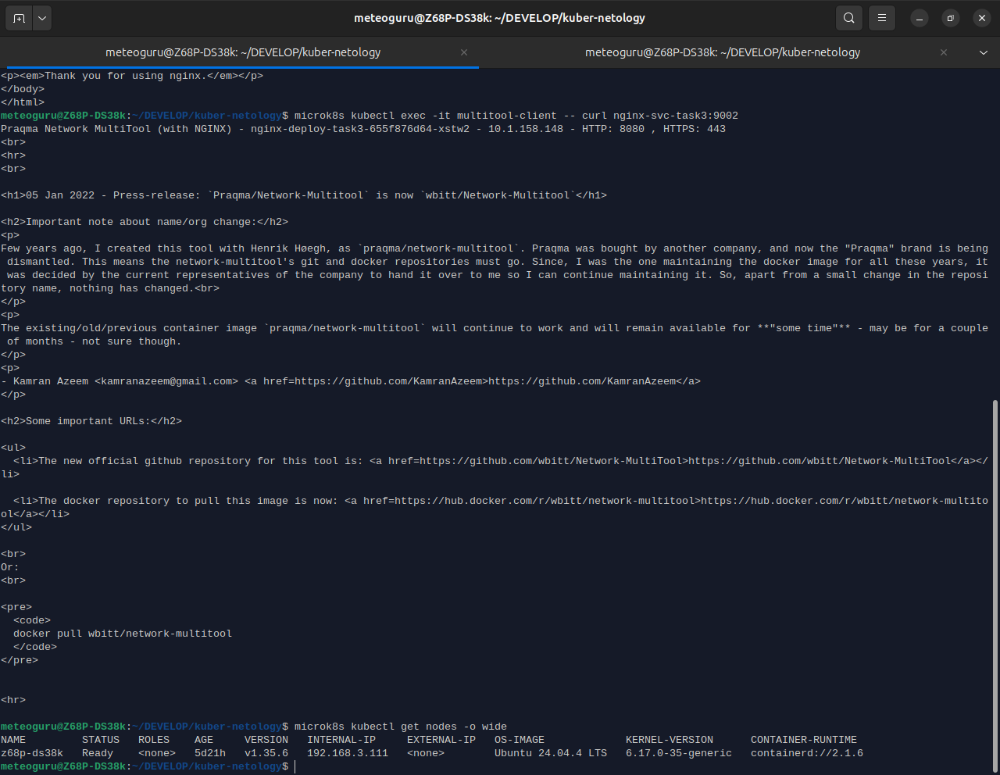
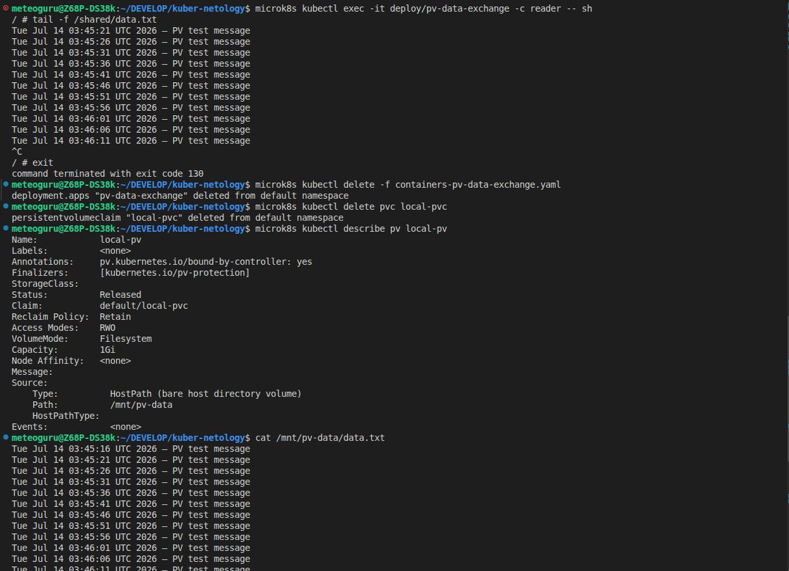

# Задание 1: Настройка Service (ClusterIP и NodePort)

1. Создать Deployment и обеспечить доступ к контейнерам приложения по разным портам из другого Pod внутри кластера

   * (я использовал microk8s, можно выполнить все команды про порядку)

### Запуск [Deployment](deployment-task3.yaml)

```
microk8s kubectl apply -f deployment-task3.yaml
```

### Запуск [Service](service-task3.yaml)

```
microk8s kubectl apply -f service-task3.yaml
```

### Запуск [Pod](multitool-pod.yaml)

```
microk8s kubectl apply -f multitool-pod.yaml
```

### Запуск [NodePort‑манифест](multitool-pod.yaml)

```
microk8s kubectl apply -f service-nodeport.yaml
```

### Проверки

```
# 3 Pod с двумя контейнерами + Pod multitool‑client

microk8s kubectl get pods
```

```
# сервис с портами 9001 и 9002.

microk8s kubectl get svc
```

```
# страница nginx на 9001 порту ⤵

microk8s kubectl exec -it multitool-client -- curl nginx-svc-task3:9001

# страница multitool на 9002 порту ⤵

microk8s kubectl exec -it multitool-client -- curl nginx-svc-task3:9002
```

```
# узнать IP ноды
microk8s kubectl get nodes -o wide

# пример: Internal-IP = 192.168.3.111
# проверить доступ к nginx через NodePort 30080

curl 192.168.3.111:30080

либо в браузере

http://192.168.3.111:30080

```

### Удаление ресурсов

```
microk8s kubectl delete -f deployment-task3.yaml
microk8s kubectl delete -f service-task3.yaml
microk8s kubectl delete -f service-nodeport.yaml
microk8s kubectl delete -f multitool-pod.yaml
```

## Далее скриншоты с выполненными командами по порядку ⤵

#### screenshot №1


#### screenshot №2



#### screenshot №3


#### screenshot №4

* (команда curl 192.168.3.111:30080 не работает из-за настроек vpn (не хотелось отключать vpn, чтобы продемонстировать, но через браузер работает при отключеном vpn ⤴ ))
  

# Задание 2: Настройка Ingress

1. Развернуть два приложения (frontend и backend) и обеспечить доступ к ним через Ingress по разным путям.
   (файлы с кодом [ingress.yaml](ingress.yaml), [service-frontend.yaml](service-frontend.yaml), [deployment-frontend.yaml](deployment-frontend.yaml), [service-backend.yaml](service-backend.yaml), [deployment-backend.yaml](deployment-backend.yaml), [configmap-backend.yaml](configmap-backend.yaml))

```
# включить ingress

microk8s enable ingress
```

```
# применить все манифесты

microk8s kubectl apply -f configmap-backend.yaml
microk8s kubectl apply -f deployment-backend.yaml
microk8s kubectl apply -f service-backend.yaml
microk8s kubectl apply -f deployment-frontend.yaml
microk8s kubectl apply -f service-frontend.yaml
microk8s kubectl apply -f ingress.yaml
```

```
# проверить ресурсы

microk8s kubectl get pods
microk8s kubectl get svc
microk8s kubectl get ingress
```

* Проверка доступности

```
# frontend по пути /

curl 127.0.0.1/

# backend по пути /api/

curl 127.0.0.1/api/
```

* Удаление всех ресурсов

```
microk8s kubectl delete -f ingress.yaml
microk8s kubectl delete -f service-frontend.yaml
microk8s kubectl delete -f deployment-frontend.yaml
microk8s kubectl delete -f service-backend.yaml
microk8s kubectl delete -f deployment-backend.yaml
microk8s kubectl delete -f configmap-backend.yaml
```

## Далее скриншоты с выполненными командами по порядку ⤵

#### screenshot №1


#### screenshot №2



*P.S. `configmap-backend.yaml` создан для того, чтобы хранить тестовую HTML‑страницу и примонтировать её в контейнер `backend`, чтобы при обращении к пути `/api/` nginx внутри Pod отдавал этот файл вместо ошибки 404*
