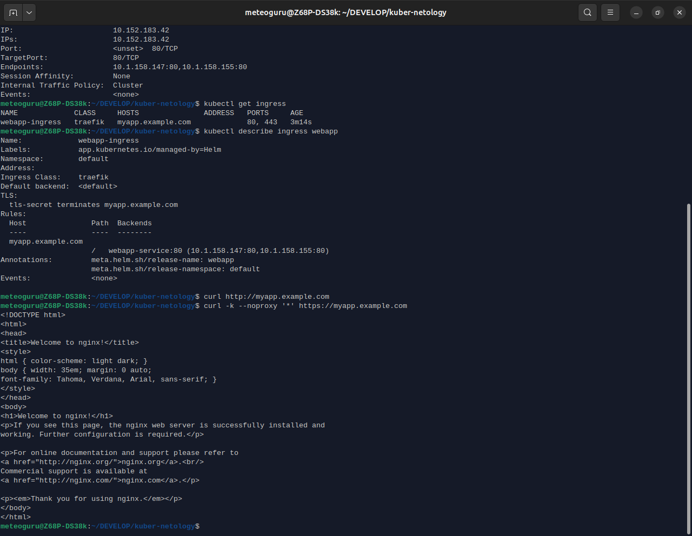

# Домашнее задание к занятию «Helm»

## Задание 1. Подготовить Helm-чарт для приложения

### Настройка kubectl для MicroK8s

```
export KUBECONFIG=/var/snap/microk8s/current/credentials/client.config
```

### Создание Helm‑чарта

```
helm create myapp
```

- Удалить ненужные шаблоны (serviceaccount.yaml, hpa.yaml, httproute.yaml), если они не используются.

### Настройка [values.yaml](myapp/values.yaml)

### Генерация TLS‑сертификата

```
openssl req -x509 -nodes -days 365 -newkey rsa:2048 \
  -keyout tls.key -out tls.crt \
  -subj "/CN=myapp.example.com/O=myapp"
```

### Создание TLS‑секрета

```
kubectl create secret tls tls-secret \
  --cert=tls.crt \
  --key=tls.key \
  --namespace=default
```

### Установка Helm‑релиза

```
helm install webapp ./myapp

# или, если релиз уже установлен:

helm upgrade webapp ./myapp
```

### Проверка ресурсов

```
helm list
kubectl get all
kubectl get ingress
kubectl describe ingress webapp-ingress
```

### Перезапуск Traefik Pod (если нужно)

```
kubectl delete pod -n ingress <traefik-pod-name>
```

### Тестирование доступа

```
curl http://myapp.example.com

# или если используется proxy

curl -k --noproxy '*' https://myapp.example.com
```

### Скриншоты

продолжение скриншота ...

---

## Задание 2. Запустить две версии в разных неймспейсах

### Создание неймспейсов

```
kubectl create namespace app1

kubectl create namespace app2
```

### Проверка

```
kubectl get ns
```

### Установка релизов Helm

```
  # Две версии в namespace app1

helm install webapp-v1 ./myapp -n app1

helm install webapp-v2 ./myapp -n app1

  # Одна версия в namespace app2

helm install webapp-v3 ./myapp -n app2
```

### Проверка всех релизов

```
helm list -A
```

### Проверка ресурсов в namespace app1

```
kubectl get all -n app1
```

### Проверка ресурсов в namespace app2

```
kubectl get all -n app2
```

### Скриншоты


продолжение скриншота ...


### Удаление всех релизов

```
helm uninstall webapp-v1 -n app1
helm uninstall webapp-v2 -n app1
helm uninstall webapp-v3 -n app2
helm uninstall webapp -n default
kubectl delete namespace app1
kubectl delete namespace app2
```
